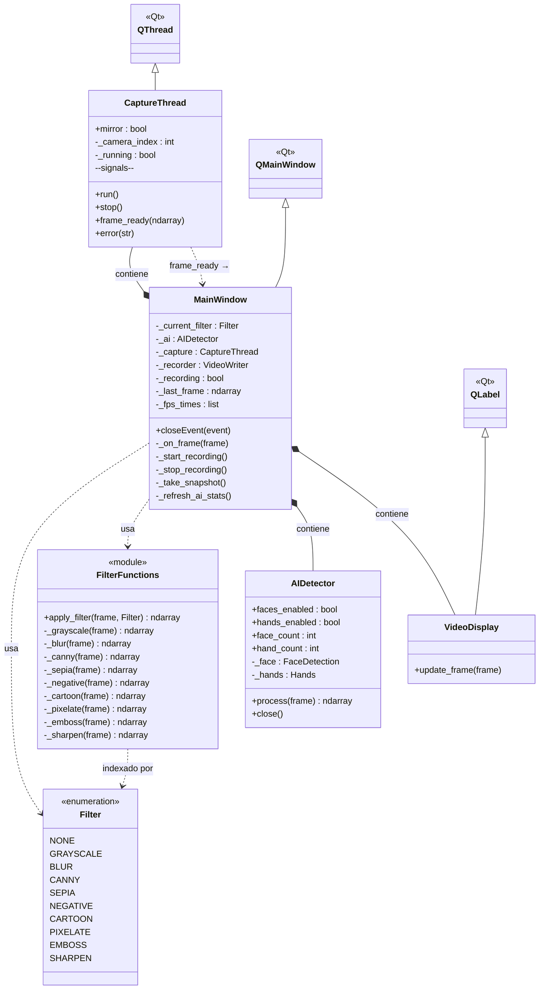

# Diagrama UML de clases — VideoLab

**Autor:** Manuel Rafael Liebana Cruz  
Sistemas Multimedia — GII, Universidad de Jaén (2025-2026)



## Descripción de las capas

| Capa | Clases | Responsabilidad |
|---|---|---|
| **Captura** | `CaptureThread` | Acceso a la webcam en hilo separado; emite fotogramas vía señal Qt |
| **Procesamiento** | `Filter`, `FilterFunctions`, `AIDetector` | Transformaciones de imagen (filtros + IA); sin dependencias de UI |
| **Interfaz** | `MainWindow`, `VideoDisplay` | Presentación, interacción con el usuario y coordinación del pipeline |

## Flujo de datos

```
Webcam
  └─► CaptureThread.run()
        └─► [señal] frame_ready
              └─► MainWindow._on_frame()
                    ├─► apply_filter(frame, filtro_activo)
                    ├─► AIDetector.process(frame)
                    ├─► VideoDisplay.update_frame(frame)   → pantalla
                    └─► VideoWriter.write(frame)           → archivo MP4 (si graba)
```
